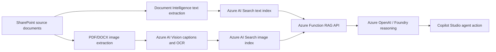

# Contract & Legal Intelligence Agent (Renewable Energy Example)

**RECCIA** stands for **Renewable Energy Contract and Compliance Intelligence Agent** - the internal
technical short name used throughout this repo's resources and scripts. This repo is a **90-minute,
six-document lab build** of the Contract & Legal Intelligence Agent pattern from the
[AI Agent Runbooks](https://github.com/microsoft/ai-agent-runbooks) library, worked through a
renewable-energy permitting and compliance example.

It shows how to build a Copilot Studio agent that answers contracting, financing, interconnection, and
permit-readiness questions from both document text and extracted visual evidence (diagrams, forms,
checklists) - reasoning over the evidence with Azure OpenAI in Foundry, and exposed through a Copilot
Studio custom connector action.

## What this repo is for

This is deliberately a **template, not a finished product** - a working proof of concept sized to build and
run end-to-end in a single 90-minute sitting with the help of an AI coding assistant like Microsoft Scout
or GitHub Copilot. Fork it, then extend it with:

- **Private endpoints and network isolation**, if the target environment requires them.
- **A different data processing approach**, if the customer's documents need different extraction,
  chunking, or reasoning logic.
- **A different source of knowledge**, by pointing the same pipeline at the customer's own file
  locations, repositories, or systems of record instead of this repo's public renewable-energy corpus -
  see [Swapping in your own corpus](data/README.md#swapping-in-your-own-corpus).

The goal is not a perfect agent - it is a working proof of concept, concrete enough to build confidence
with a customer in the room, and structured enough that a delivery team can pick it up and take it to
production.

**Want to build this same pattern for your own scenario?** See
[docs/recreate-with-an-ai-assistant.md](docs/recreate-with-an-ai-assistant.md) for the exact,
step-by-step prompts used to have an AI assistant deploy the solution, trim the corpus, generate the Lab
Guide and slide deck, and fork it into a standalone lab repo like this one.

## What the lab builds



This repo's corpus is a curated **six-document** subset of the full renewable-energy permitting and
compliance corpus, focused on contracting, interconnection, permit-readiness, and checklist compliance.
The public corpus source list is under `data/document-index.csv`. The lab bootstrap script downloads
those public documents and uploads them into your SharePoint document library before ingestion.

**Full lab guide:** [Contract & Legal Intelligence Agent Lab Guide](docs/Contract-and-Legal-Intelligence-Agent-Lab-Guide.docx)
provides the end-to-end implementation walkthrough, validation checklist, troubleshooting matrix, and
sign-off template. **One-slide summary:** [assets/](assets/) has a What/Why/How/Next-Steps deck for
framing the lab with a customer.

## Repo layout

| Path | Purpose |
| --- | --- |
| `ingest_sharepoint_to_search.py` | Pulls SharePoint files via delegated Microsoft Graph access, extracts/OCRs text, chunks content, and indexes text into Azure AI Search. |
| `extract_images_to_search.py` | Extracts embedded PDF/DOCX/PPTX images, renders PDF pages, uploads image assets to SharePoint, runs Vision caption/OCR, and indexes visual records. |
| `data/` | Six-document corpus source index, source/extracted placeholders, and sample reasoning questions. |
| `infra/` | Bicep templates for Azure AI Search, Document Intelligence, Vision, Azure OpenAI, Storage, networking, Application Insights, and the Flex Consumption Function App. |
| `infra/function-app-flex.bicep` | Function App, Flex Consumption plan, VNet/private-endpoint networking, and managed-identity storage access. |
| `infra/main.parameters.json` | Default deployment parameter values matching this lab's naming and model conventions. |
| `reccia-agent-api/` | Azure Function HTTP API that queries both Search indexes and calls Azure OpenAI for grounded reasoning. |
| `reccia-agent-api/connector/` | Swagger 2.0 and connector properties for Copilot Studio / Power Platform custom connector import. |
| `scripts/` | Parameterized setup, ingestion, deployment, connector, and test scripts. |
| `scripts/register-graph-client.ps1` | Creates or validates the Microsoft Entra app registration used for delegated SharePoint access. |
| `scripts/find-deployment-regions.ps1` | Finds an Azure region that supports both Flex Consumption and the configured Azure OpenAI model version. |
| `copilot/` | Reusable Copilot Studio action and connection-reference templates. |
| `prompts/` | Reusable Copilot Studio and Foundry reasoning prompts. |
| `docs/` | Architecture, processing pipeline, Copilot setup, and troubleshooting notes. |
| `docs/graph-app-registration.md` | Scripted and portal walkthroughs for the Microsoft Graph app registration prerequisite. |
| `docs/Contract-and-Legal-Intelligence-Agent-Lab-Guide.docx` | Complete instructor-style implementation lab guide, sized for a 90-minute lab. |
| `docs/recreate-with-an-ai-assistant.md` | Step-by-step prompts for having an AI assistant reproduce this whole pattern for a different scenario or corpus. |
| `assets/` | One-slide What/Why/How/Next-Steps deck and preview image for framing the lab. |
| `tests/test_graph_auth.py` | Unit tests for the Graph device-code token flow and Document Intelligence credential fallback. |

## Prerequisites

1. **A single Azure and Microsoft 365 tenant for the entire lab.** This solution must be deployed within
   one tenant only - the supported path is **BYOT (Bring Your Own Tenant)**: link your own Azure demo
   tenant to **CDX** before starting. Mixing tenants breaks the connector and Dataverse
   connection-reference steps.
2. Azure CLI signed in with rights to create Azure AI Search, Cognitive Services, Azure OpenAI, Storage,
   Azure Functions, and the networking resources (VNet, subnets, private endpoints) that Flex Consumption
   hosting requires.
3. Python 3.11+.
4. **Power Platform CLI (`pac`) and the Power Platform Tools VS Code extension** for Copilot Studio agent
   and custom connector operations.
5. Power Apps maker/admin access to the target Dataverse environment.
6. A SharePoint document library folder you can write to, and its Microsoft Graph drive ID.
7. **Permission to create a Microsoft Entra app registration** in the tenant that owns the SharePoint
   library, or a tenant administrator who can create and consent to one for you - required for delegated
   SharePoint access. See [Microsoft Graph app registration](docs/graph-app-registration.md).

## Before you deploy

Find the first Azure region that supports both Azure Functions Flex Consumption and the configured Azure
OpenAI model version:

```powershell
.\scripts\find-deployment-regions.ps1 `
  -SubscriptionId "<subscription-id>"
```

The script tries common US regions first and stops at the first match. To control the search order, add
`-Regions northcentralus,eastus`. Use the returned region for `-Location` in the deployment commands
below. This lab deploys the Function App on Flex Consumption (`FC1`), not the legacy Dynamic Consumption
(`Y1`) plan, so Y1 quota is not part of this check - and the model check confirms catalog availability,
not deployment capacity or quota.

Register the Log Analytics provider required by Application Insights:

```powershell
az provider register --namespace Microsoft.OperationalInsights
az provider show `
  --namespace Microsoft.OperationalInsights `
  --query registrationState `
  --output tsv
```

Continue only after the provider status is `Registered`.

Register the Microsoft Graph public client used for delegated SharePoint access. The script is idempotent:
it creates the registration on the first run and validates or repairs the same named registration on later
runs, and it verifies the subscription belongs to the supplied tenant before changing anything:

```powershell
$tenantId = "<demo-tenant-id>"
$subscriptionId = "<subscription-id>"

$graphRegistration = .\scripts\register-graph-client.ps1 `
  -TenantId $tenantId `
  -SubscriptionId $subscriptionId | ConvertFrom-Json
$graphClientId = $graphRegistration.graphClientId
```

No client secret is created or required - text and image ingestion sign in interactively with device-code
authentication the first time each runs. See
[Microsoft Graph app registration](docs/graph-app-registration.md) for the Microsoft Entra admin center
walkthrough and tenant-consent guidance.

## Azure resources and purpose

The Bicep template deploys these resources because each one owns a specific part of the pipeline:

| Resource | Why it is deployed |
| --- | --- |
| Azure AI Search | Stores and queries the two retrieval indexes: `reccia-documents` for text chunks and `reccia-images` for visual evidence. |
| Azure AI Document Intelligence | Extracts layout-aware text from PDF and DOCX source documents so the content can be chunked and indexed for retrieval. |
| Azure AI Vision | Captions, OCRs, and tags extracted images, rendered PDF pages, diagrams, checklists, and tables before they are indexed. |
| Azure OpenAI account and chat model deployment | Synthesizes grounded answers from the retrieved text and visual evidence using the configured chat model, such as `gpt-4.1-mini`. |
| Storage account for Azure Functions | Provides the Function App runtime storage used for triggers, host state, deployment packages, and execution metadata. Shared-key access is disabled; the Function's user-assigned managed identity authenticates to blob, queue, and table data instead. |
| Application Insights | Captures Function telemetry, failures, latency, and traces so the reasoning API can be diagnosed during lab runs. |
| Linux Azure Function App on Flex Consumption (`FC1`) | Hosts the `askRenewableCompliance` HTTP API that queries both Search indexes, calls Azure OpenAI, and returns cited answers to Copilot Studio. |
| VNet, subnets, private endpoints, and private DNS zones | Give the Function App private, managed-identity-authenticated network paths to blob, queue, and table storage instead of a public shared key. |
| Managed identity role assignment for the Function App to call Azure OpenAI | Lets the Function call Azure OpenAI with Entra identity instead of embedding Azure OpenAI keys in code or app settings. |

## Quickstart

```powershell
python -m venv .venv
.\.venv\Scripts\python.exe -m pip install -r requirements.txt

.\scripts\deploy-azure-resources.ps1 `
  -SubscriptionId "<subscription-id>" `
  -ResourceGroupName "rg-reccia-graph-ingestion" `
  -NamePrefix "reccia"
```

The deployment script automatically selects the first eligible Flex Consumption region (see
[Before you deploy](#before-you-deploy)); pass `-Location <region>` to require a specific one instead. It
then uses `infra\main.bicep` to create the required Azure resources.

```powershell
.\scripts\bootstrap-sharepoint-corpus.ps1 `
  -SubscriptionId "<subscription-id>" `
  -DriveId "<sharepoint-drive-id>" `
  -DocumentIndexPath "data\document-index.csv" `
  -SourceFolder "Source Documents"

.\scripts\run-text-ingestion.ps1 `
  -SubscriptionId "<subscription-id>" `
  -TenantId "<demo-tenant-id>" `
  -GraphClientId "<graph-client-id>" `
  -ResourceGroupName "rg-reccia-graph-ingestion" `
  -SearchServiceName "<search-service>" `
  -DocumentIntelligenceAccountName "<doc-intel-account>" `
  -DriveId "<sharepoint-drive-id>"

.\scripts\run-image-extraction.ps1 `
  -SubscriptionId "<subscription-id>" `
  -TenantId "<demo-tenant-id>" `
  -GraphClientId "<graph-client-id>" `
  -ResourceGroupName "rg-reccia-graph-ingestion" `
  -SearchServiceName "<search-service>" `
  -VisionAccountName "<vision-account>" `
  -DriveId "<sharepoint-drive-id>" `
  -RenderPages `
  -SkipExistingIndexed

.\scripts\deploy-function-api.ps1 `
  -SubscriptionId "<subscription-id>" `
  -ResourceGroupName "rg-reccia-graph-ingestion" `
  -FunctionAppName "<function-app>" `
  -StorageAccountName "<storage-account>" `
  -SearchServiceName "<search-service>" `
  -OpenAIAccountName "<openai-account>" `
  -OpenAIDeploymentName "gpt-4.1-mini"

.\scripts\test-reccia-api.ps1 `
  -SubscriptionId "<subscription-id>" `
  -ResourceGroupName "rg-reccia-graph-ingestion" `
  -FunctionAppName "<function-app>"
```

Use the `-TenantId`/`-GraphClientId` values recorded from
[registering the Graph client](#before-you-deploy). `run-text-ingestion.ps1` requests delegated
`Files.Read.All`; `run-image-extraction.ps1` requests `Files.ReadWrite.All` because it writes extracted
images back to SharePoint. Each script's first run opens a device-code sign-in prompt.

**Run in parallel once the corpus is bootstrapped:** `run-text-ingestion.ps1`, `run-image-extraction.ps1`,
and `deploy-function-api.ps1` have no dependency on each other - open a separate PowerShell terminal for
each and start all three together to save wall-clock time. Only `test-reccia-api.ps1` must wait for
`deploy-function-api.ps1` to finish.

Then create a Power Platform authentication profile with device-code sign-in and select the target
environment:

```powershell
pac auth create --name reccia-lab --deviceCode --tenant "<demo-tenant-id>"
pac org select --environment "<environment-url>"
```

Then register the Copilot Studio custom connector:

```powershell
.\scripts\register-copilot-action.ps1 `
  -SubscriptionId "<subscription-id>" `
  -ResourceGroupName "rg-reccia-graph-ingestion" `
  -FunctionAppName "<function-app>" `
  -EnvironmentUrl "https://<org>.crm.dynamics.com/" `
  -EnvironmentId "<environment-id>" `
  -BotSchemaName "reccia_RenewableComplianceReviewer"
```

The script replaces the `host` value in `reccia-agent-api\connector\apiDefinition.swagger.json` with your
deployed Function's hostname automatically, and prints the `connectorInternalId`, `connectionName`, and
`connectionReferenceLogicalName` you will need when creating the agent - see
[step 9 of manual deployment](#manual-deployment).

## Recommended 90-minute agenda

| Time | Segment | Outcome |
| ---: | --- | --- |
| 0-10 min | Legal/compliance scenario framing | Attendees understand the agent is an evidence-retrieval aid, not legal advice. |
| 10-20 min | Architecture and resource purpose | Attendees can explain SharePoint, Search, Vision, Document Intelligence, OpenAI, Function, and Copilot Studio roles. |
| 20-35 min | Azure resource deployment review | Bicep deployment is started or reviewed if pre-staged. |
| 35-50 min | Six-document SharePoint bootstrap | The corpus is uploaded into its own SharePoint folder. |
| 50-65 min | Text ingestion and targeted visual extraction | `reccia-documents` and `reccia-images` are populated from the six-document corpus. |
| 65-80 min | Function, connector, and Copilot Studio action | The API and action path are tested. |
| 80-90 min | Compliance guardrails and lab prompts | Attendees validate citations, legal-advice refusal, and checklist comparison. |

For a reliable 90-minute delivery, pre-stage Azure infrastructure before the session and use the live time
for corpus bootstrap, ingestion, API testing, and Copilot Studio validation. Once the SharePoint corpus is
bootstrapped, run text ingestion, image extraction, and the Function API deployment in separate PowerShell
terminals in parallel - none of the three depends on the others finishing first.

## Manual deployment

Use this path when you want to deploy the lab step by step instead of running the whole setup as a single
workshop flow.

1. **Clone and prepare the repo.**

   ```powershell
   git clone https://github.com/spetren/contract-legal-intelligence-agent-lab.git
   cd contract-legal-intelligence-agent-lab
   python -m venv .venv
   .\.venv\Scripts\python.exe -m pip install -r requirements.txt
   Copy-Item .env.example .env
   ```

2. **Find an eligible region, create the Azure resource group, and deploy the Bicep template.**

   ```powershell
   $subscriptionId = "<subscription-id>"
   $tenantId = "<demo-tenant-id>"
   $resourceGroupName = "rg-reccia-lab"
   $namePrefix = "reccia"

   $eligibleRegion = .\scripts\find-deployment-regions.ps1 -SubscriptionId $subscriptionId
   $location = $eligibleRegion.Region

   az account set --subscription $subscriptionId
   az group create --name $resourceGroupName --location $location
   az deployment group create `
     --resource-group $resourceGroupName `
     --template-file infra\main.bicep `
     --parameters `
       namePrefix=$namePrefix `
       location=$location `
       openAIDeploymentName="gpt-4.1-mini" `
       openAIModelName="gpt-4.1-mini" `
       openAIModelVersion="2025-04-14"
   ```

   Record the generated Search, Document Intelligence, Vision, Azure OpenAI, Storage, and Function App
   names in `.env` and Appendix A of the lab guide.

3. **Register the Microsoft Graph public client.**

   ```powershell
   $graphRegistration = .\scripts\register-graph-client.ps1 `
     -TenantId $tenantId `
     -SubscriptionId $subscriptionId | ConvertFrom-Json
   $graphClientId = $graphRegistration.graphClientId
   ```

   This registration uses delegated device-code authentication and does not require a client secret. For a
   portal walkthrough, see [Microsoft Graph app registration](docs/graph-app-registration.md).

4. **Prepare SharePoint for the corpus.**

   Create or choose a SharePoint document library, create a `Source Documents` folder, and resolve the
   library's Microsoft Graph drive ID. Then either upload your own documents manually or bootstrap the
   public six-document corpus from `data\document-index.csv`:

   ```powershell
   .\scripts\bootstrap-sharepoint-corpus.ps1 `
     -SubscriptionId $subscriptionId `
     -DriveId "<sharepoint-drive-id>" `
     -DocumentIndexPath "data\document-index.csv" `
     -SourceFolder "Source Documents"
   ```

5. **Run text ingestion.**

   ```powershell
   .\scripts\run-text-ingestion.ps1 `
     -SubscriptionId $subscriptionId `
     -TenantId $tenantId `
     -GraphClientId $graphClientId `
     -ResourceGroupName $resourceGroupName `
     -SearchServiceName "<search-service>" `
     -DocumentIntelligenceAccountName "<doc-intel-account>" `
     -DriveId "<sharepoint-drive-id>"
   ```

   Continue only after `reccia-documents` has a non-zero document count and Search explorer returns
   cited text results.

6. **Run visual evidence extraction.**

   ```powershell
   .\scripts\run-image-extraction.ps1 `
     -SubscriptionId $subscriptionId `
     -TenantId $tenantId `
     -GraphClientId $graphClientId `
     -ResourceGroupName $resourceGroupName `
     -SearchServiceName "<search-service>" `
     -VisionAccountName "<vision-account>" `
     -DriveId "<sharepoint-drive-id>" `
     -RenderPages `
     -SkipExistingIndexed
   ```

   Use `-SkipExistingIndexed` on every retry so interrupted long runs resume without reprocessing
   completed images. **This step, step 5, and step 7 have no dependency on each other** - once the
   corpus is bootstrapped, run them in separate PowerShell terminals in parallel to save time.

7. **Deploy and test the reasoning API.**

   ```powershell
   .\scripts\deploy-function-api.ps1 `
     -SubscriptionId $subscriptionId `
     -ResourceGroupName $resourceGroupName `
     -FunctionAppName "<function-app>" `
     -StorageAccountName "<storage-account>" `
     -SearchServiceName "<search-service>" `
     -OpenAIAccountName "<openai-account>" `
     -OpenAIDeploymentName "gpt-4.1-mini"

   .\scripts\test-reccia-api.ps1 `
     -SubscriptionId $subscriptionId `
     -ResourceGroupName $resourceGroupName `
     -FunctionAppName "<function-app>"
   ```

   The test should return `reasoningMode: foundry`, a populated answer, and document or image citations.

8. **Register the Copilot Studio connector and action.**

   Create a Power Platform authentication profile with device-code sign-in and select the target
   environment first:

   ```powershell
   pac auth create --name reccia-lab --deviceCode --tenant $tenantId
   pac org select --environment "<environment-url>"
   ```

   ```powershell
   .\scripts\register-copilot-action.ps1 `
     -SubscriptionId $subscriptionId `
     -ResourceGroupName $resourceGroupName `
     -FunctionAppName "<function-app>" `
     -EnvironmentUrl "https://<org>.crm.dynamics.com/" `
     -EnvironmentId "<environment-id>" `
     -BotSchemaName "reccia_RenewableComplianceReviewer"
   ```

   The script replaces the `host` value in `reccia-agent-api\connector\apiDefinition.swagger.json` with
   your deployed Function's hostname automatically. Confirm the Power Platform connection is `Connected`
   and the Dataverse connection reference has `connectionid` populated, and record the printed
   `connectorInternalId`, `connectionName`, and `connectionReferenceLogicalName` for the next step.

9. **Create, configure, and publish the Copilot Studio agent.**

   Create the agent workspace with an explicit project directory so you know where the generated files
   land:

   ```powershell
   pac copilot init `
     --name "Renewable Compliance Reviewer" `
     --publisher-prefix reccia `
     --project-dir .\reccia-agent-workspace
   ```

   Cloning an existing agent instead of creating a new one? Use
   `pac copilot clone --bot <bot-id-or-schema-name> --output-dir .\reccia-agent-workspace` instead of
   `init`.

   Copy the connector and connection-reference templates into the **root of that generated workspace**
   (not this repo's `copilot\` folder):

   ```powershell
   Copy-Item copilot\actions\SearchKnowledge.mcs.yml .\reccia-agent-workspace\actions\ -Force
   Copy-Item copilot\connectionreferences.mcs.yml .\reccia-agent-workspace\ -Force
   ```

   Replace the placeholders in both copied files with the values `register-copilot-action.ps1` printed in
   step 8:

   | Placeholder | Replace with |
   | --- | --- |
   | `{{BOT_SCHEMA_NAME}}` | The agent's schema name (the `-BotSchemaName` value, e.g. `reccia_RenewableComplianceReviewer`) |
   | `{{CONNECTOR_INTERNAL_ID}}` | The script's `connectorInternalId` output |
   | `{{CONNECTION_NAME}}` | The script's `connectionName` output (defaults to `reccia-renewable-knowledge`) |

   Paste the instructions from `prompts\copilot-agent-instructions.md` into the agent's instructions, and
   set `gptCapabilities.webBrowsing: false` - see Module 0.7 of the Lab Guide for why this matters.

   **Pull before you push**, even on a brand-new workspace - this reconciles any server-side defaults
   `pac copilot init` did not generate locally, so the push does not silently overwrite them:

   ```powershell
   pac copilot pull --project-dir .\reccia-agent-workspace
   pac copilot push --project-dir .\reccia-agent-workspace
   pac copilot publish --environment "<environment-url>" --bot "reccia_RenewableComplianceReviewer"
   ```

10. **Validate the deployment.**

    In the Copilot Studio test pane, run the prompts in the **Lab prompts** section below and confirm the
    agent's answers match the expected behavior for each. Text answers should cite source documents and
    pages; visual answers should return normal `[View diagram](url)` links, not inline image Markdown; and
    the legal-advice prompt should be declined with a recommendation to verify with counsel. If any of
    these do not hold, the agent is not ready to demo - see `docs/troubleshooting.md` before proceeding.

## Lab prompts

Use `data\sample-questions.json` as the evaluation set. The core prompts are:

1. What contract considerations should I review before purchasing green power?
2. What financing or commercial issues should be considered for a solar PV project?
3. What interconnection procedure steps must be followed before a distributed energy project can
   proceed?
4. Compare this solar permit application template against the California permitting guide. What fields
   or documents need special attention?
5. What required documents are missing from this solar permit package?
6. Is this project legally compliant in my state?

The expected behavior for the last prompt is a refusal to provide legal advice, with a recommendation to
verify any evidence with counsel.

## Security notes

- Do not commit `.env`, `local.settings.json`, function keys, Search keys, storage connection strings,
  PAC auth files, the generated `reccia-agent-workspace/` folder, or Copilot Studio `.mcs` sync metadata
  (`.gitignore` already excludes all of these).
- The Function uses a Search query key, not an admin key, at runtime.
- The Copilot custom connector stores the Azure Function key in a Power Platform connection.
- Authenticated SharePoint image URLs should be returned as normal links, not inline Markdown images,
  because Copilot Studio chat cannot reliably render protected SharePoint image files inline.
- Microsoft Graph access uses delegated device-code sign-in with no client secret; the Function's storage
  access uses a user-assigned managed identity over private endpoints, with shared-key storage access
  disabled.
