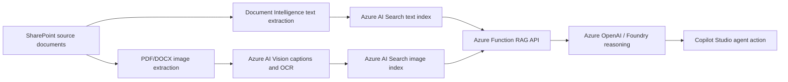

# Contract & Legal Intelligence Agent (Renewable Energy Example)

**RECCIA** stands for **Renewable Energy Contract and Compliance Intelligence Agent** - the internal
technical short name used throughout this repo's resources and scripts. This repo is a **90-minute,
six-document demo build** of the Contract & Legal Intelligence Agent pattern from the
[AI Agent Runbooks](https://github.com/microsoft/ai-agent-runbooks) library, worked through a
renewable-energy permitting and compliance example.

It shows how to build a Copilot Studio agent that answers contracting, financing, interconnection, and
permit-readiness questions from both document text and extracted visual evidence (diagrams, forms,
checklists) - reasoning over the evidence with Azure OpenAI in Foundry, and exposed through a Copilot
Studio custom connector action.

## What this repo is for

This is deliberately a **template, not a finished product** - a working proof of concept sized to build and
demo end-to-end in a single 90-minute sitting with the help of an AI coding assistant like Microsoft Scout
or GitHub Copilot. Fork it, then extend it with:

- **Private endpoints and network isolation**, if the target environment requires them.
- **A different data processing approach**, if the customer's documents need different extraction,
  chunking, or reasoning logic.
- **A different source of knowledge**, by pointing the same pipeline at the customer's own file
  locations, repositories, or systems of record instead of this repo's public renewable-energy corpus -
  see [Swapping in your own corpus](data/README.md#swapping-in-your-own-corpus).

The goal is not a perfect agent - it is a working proof of concept, concrete enough to build confidence
with a customer in the room, and structured enough that a delivery team can pick it up and take it to
production.

## What the lab builds



This repo's corpus is a curated **six-document** subset of the full renewable-energy permitting and
compliance corpus, focused on contracting, interconnection, permit-readiness, and checklist compliance.
The public corpus source list is under `data/document-index.csv`. The lab bootstrap script downloads
those public documents and uploads them into your SharePoint document library before ingestion.

**Full lab guide:** [Contract & Legal Intelligence Agent Lab Guide](docs/Contract-and-Legal-Intelligence-Agent-Lab-Guide.docx)
provides the end-to-end implementation walkthrough, validation checklist, troubleshooting matrix, and
sign-off template. **One-slide summary:** [assets/](assets/) has a What/Why/How/Next-Steps deck for
framing the demo with a customer.

## Repo layout

| Path | Purpose |
| --- | --- |
| `ingest_sharepoint_to_search.py` | Pulls SharePoint files, extracts/OCRs text, chunks content, and indexes text into Azure AI Search. |
| `extract_images_to_search.py` | Extracts embedded PDF/DOCX/PPTX images, renders PDF pages, uploads image assets to SharePoint, runs Vision caption/OCR, and indexes visual records. |
| `data/` | Six-document corpus source index, source/extracted placeholders, and sample reasoning questions. |
| `infra/` | Bicep template for Azure AI Search, Document Intelligence, Vision, Azure OpenAI, Storage, Application Insights, and Azure Functions. |
| `reccia-agent-api/` | Azure Function HTTP API that queries both Search indexes and calls Azure OpenAI for grounded reasoning. |
| `reccia-agent-api/connector/` | Swagger 2.0 and connector properties for Copilot Studio / Power Platform custom connector import. |
| `scripts/` | Parameterized setup, ingestion, deployment, connector, and test scripts. |
| `copilot/` | Reusable Copilot Studio action and connection-reference templates. |
| `prompts/` | Reusable Copilot Studio and Foundry reasoning prompts. |
| `docs/` | Architecture, processing pipeline, Copilot setup, and troubleshooting notes. |
| `docs/Contract-and-Legal-Intelligence-Agent-Lab-Guide.docx` | Complete instructor-style implementation lab guide, sized for a 90-minute demo. |
| `assets/` | One-slide What/Why/How/Next-Steps deck and preview image for framing the demo. |

## Prerequisites

1. **A single Azure and Microsoft 365 tenant for the entire lab.** This solution must be deployed within
   one tenant only - the supported path is **BYOT (Bring Your Own Tenant)**: link your own Azure demo
   tenant to **CDX** before starting. Mixing tenants breaks the connector and Dataverse
   connection-reference steps.
2. Azure CLI signed in with rights to create Azure AI Search, Cognitive Services, Azure OpenAI, Storage,
   and Azure Functions.
3. Python 3.11+.
4. Power Platform CLI (`pac`) for Copilot Studio agent and custom connector operations.
5. Power Apps maker/admin access to the target Dataverse environment.
6. A SharePoint document library folder you can write to, and its Microsoft Graph drive ID.

## Azure resources and purpose

The Bicep template deploys these resources because each one owns a specific part of the pipeline:

| Resource | Why it is deployed |
| --- | --- |
| Azure AI Search | Stores and queries the two retrieval indexes: `reccia-documents` for text chunks and `reccia-images` for visual evidence. |
| Azure AI Document Intelligence | Extracts layout-aware text from PDF and DOCX source documents so the content can be chunked and indexed for retrieval. |
| Azure AI Vision | Captions, OCRs, and tags extracted images, rendered PDF pages, diagrams, checklists, and tables before they are indexed. |
| Azure OpenAI account and chat model deployment | Synthesizes grounded answers from the retrieved text and visual evidence using the configured chat model, such as `gpt-4.1-mini`. |
| Storage account for Azure Functions | Provides the Function App runtime storage used for triggers, host state, deployment packages, and execution metadata. |
| Application Insights | Captures Function telemetry, failures, latency, and traces so the reasoning API can be diagnosed during lab runs. |
| Linux Azure Function App | Hosts the `askRenewableCompliance` HTTP API that queries both Search indexes, calls Azure OpenAI, and returns cited answers to Copilot Studio. |
| Managed identity role assignment for the Function App to call Azure OpenAI | Lets the Function call Azure OpenAI with Entra identity instead of embedding Azure OpenAI keys in code or app settings. |

## Quickstart

```powershell
python -m venv .venv
.\.venv\Scripts\python.exe -m pip install -r requirements.txt

.\scripts\deploy-azure-resources.ps1 `
  -SubscriptionId "<subscription-id>" `
  -ResourceGroupName "rg-reccia-graph-ingestion" `
  -Location "eastus" `
  -NamePrefix "reccia"
```

The deployment script uses `infra\main.bicep` to create the required Azure resources.

```powershell
.\scripts\bootstrap-sharepoint-corpus.ps1 `
  -SubscriptionId "<subscription-id>" `
  -DriveId "<sharepoint-drive-id>" `
  -DocumentIndexPath "data\document-index.csv" `
  -SourceFolder "Source Documents"

.\scripts\run-text-ingestion.ps1 `
  -SubscriptionId "<subscription-id>" `
  -ResourceGroupName "rg-reccia-graph-ingestion" `
  -SearchServiceName "<search-service>" `
  -DocumentIntelligenceAccountName "<doc-intel-account>" `
  -DriveId "<sharepoint-drive-id>"

.\scripts\run-image-extraction.ps1 `
  -SubscriptionId "<subscription-id>" `
  -ResourceGroupName "rg-reccia-graph-ingestion" `
  -SearchServiceName "<search-service>" `
  -VisionAccountName "<vision-account>" `
  -DriveId "<sharepoint-drive-id>" `
  -RenderPages `
  -SkipExistingIndexed

.\scripts\deploy-function-api.ps1 `
  -SubscriptionId "<subscription-id>" `
  -ResourceGroupName "rg-reccia-graph-ingestion" `
  -FunctionAppName "<function-app>" `
  -StorageAccountName "<storage-account>" `
  -SearchServiceName "<search-service>" `
  -OpenAIAccountName "<openai-account>" `
  -OpenAIDeploymentName "gpt-4.1-mini"

.\scripts\test-reccia-api.ps1 `
  -SubscriptionId "<subscription-id>" `
  -ResourceGroupName "rg-reccia-graph-ingestion" `
  -FunctionAppName "<function-app>"
```

Then register the Copilot Studio custom connector:

```powershell
.\scripts\register-copilot-action.ps1 `
  -SubscriptionId "<subscription-id>" `
  -ResourceGroupName "rg-reccia-graph-ingestion" `
  -FunctionAppName "<function-app>" `
  -EnvironmentUrl "https://<org>.crm.dynamics.com/" `
  -EnvironmentId "<environment-id>" `
  -BotSchemaName "reccia_RenewableComplianceReviewer"
```

## Recommended 90-minute agenda

| Time | Segment | Outcome |
| ---: | --- | --- |
| 0-10 min | Legal/compliance scenario framing | Attendees understand the agent is an evidence-retrieval aid, not legal advice. |
| 10-20 min | Architecture and resource purpose | Attendees can explain SharePoint, Search, Vision, Document Intelligence, OpenAI, Function, and Copilot Studio roles. |
| 20-35 min | Azure resource deployment review | Bicep deployment is started or reviewed if pre-staged. |
| 35-50 min | Six-document SharePoint bootstrap | The corpus is uploaded into its own SharePoint folder. |
| 50-65 min | Text ingestion and targeted visual extraction | `reccia-documents` and `reccia-images` are populated from the six-document corpus. |
| 65-80 min | Function, connector, and Copilot Studio action | The API and action path are tested. |
| 80-90 min | Compliance guardrails and demo prompts | Attendees validate citations, legal-advice refusal, and checklist comparison. |

For a reliable 90-minute delivery, pre-stage Azure infrastructure before the session and use the live time
for corpus bootstrap, ingestion, API testing, and Copilot Studio validation.

## Manual deployment

Use this path when you want to deploy the lab step by step instead of running the whole setup as a single
workshop flow.

1. **Clone and prepare the repo.**

   ```powershell
   git clone https://github.com/spetren/contract-legal-intelligence-agent-demo.git
   cd contract-legal-intelligence-agent-demo
   python -m venv .venv
   .\.venv\Scripts\python.exe -m pip install -r requirements.txt
   Copy-Item .env.example .env
   ```

2. **Create the Azure resource group and deploy the Bicep template.**

   ```powershell
   $subscriptionId = "<subscription-id>"
   $resourceGroupName = "rg-reccia-lab"
   $location = "eastus"
   $namePrefix = "reccia"

   az account set --subscription $subscriptionId
   az group create --name $resourceGroupName --location $location
   az deployment group create `
     --resource-group $resourceGroupName `
     --template-file infra\main.bicep `
     --parameters `
       namePrefix=$namePrefix `
       location=$location `
       openAIDeploymentName="gpt-4.1-mini" `
       openAIModelName="gpt-4.1-mini" `
       openAIModelVersion="2025-04-14"
   ```

   Record the generated Search, Document Intelligence, Vision, Azure OpenAI, Storage, and Function App
   names in `.env` and Appendix A of the lab guide.

3. **Prepare SharePoint for the corpus.**

   Create or choose a SharePoint document library, create a `Source Documents` folder, and resolve the
   library's Microsoft Graph drive ID. Then either upload your own documents manually or bootstrap the
   public six-document corpus from `data\document-index.csv`:

   ```powershell
   .\scripts\bootstrap-sharepoint-corpus.ps1 `
     -SubscriptionId $subscriptionId `
     -DriveId "<sharepoint-drive-id>" `
     -DocumentIndexPath "data\document-index.csv" `
     -SourceFolder "Source Documents"
   ```

4. **Run text ingestion.**

   ```powershell
   .\scripts\run-text-ingestion.ps1 `
     -SubscriptionId $subscriptionId `
     -ResourceGroupName $resourceGroupName `
     -SearchServiceName "<search-service>" `
     -DocumentIntelligenceAccountName "<doc-intel-account>" `
     -DriveId "<sharepoint-drive-id>"
   ```

   Continue only after `reccia-documents` has a non-zero document count and Search explorer returns
   cited text results.

5. **Run visual evidence extraction.**

   ```powershell
   .\scripts\run-image-extraction.ps1 `
     -SubscriptionId $subscriptionId `
     -ResourceGroupName $resourceGroupName `
     -SearchServiceName "<search-service>" `
     -VisionAccountName "<vision-account>" `
     -DriveId "<sharepoint-drive-id>" `
     -RenderPages `
     -SkipExistingIndexed
   ```

   Use `-SkipExistingIndexed` on every retry so interrupted long runs resume without reprocessing
   completed images.

6. **Deploy and test the reasoning API.**

   ```powershell
   .\scripts\deploy-function-api.ps1 `
     -SubscriptionId $subscriptionId `
     -ResourceGroupName $resourceGroupName `
     -FunctionAppName "<function-app>" `
     -StorageAccountName "<storage-account>" `
     -SearchServiceName "<search-service>" `
     -OpenAIAccountName "<openai-account>" `
     -OpenAIDeploymentName "gpt-4.1-mini"

   .\scripts\test-reccia-api.ps1 `
     -SubscriptionId $subscriptionId `
     -ResourceGroupName $resourceGroupName `
     -FunctionAppName "<function-app>"
   ```

   The test should return `reasoningMode: foundry`, a populated answer, and document or image citations.

7. **Register the Copilot Studio connector and action.**

   ```powershell
   .\scripts\register-copilot-action.ps1 `
     -SubscriptionId $subscriptionId `
     -ResourceGroupName $resourceGroupName `
     -FunctionAppName "<function-app>" `
     -EnvironmentUrl "https://<org>.crm.dynamics.com/" `
     -EnvironmentId "<environment-id>" `
     -BotSchemaName "reccia_RenewableComplianceReviewer"
   ```

   Confirm the Power Platform connection is `Connected` and the Dataverse connection reference has
   `connectionid` populated.

8. **Create, configure, and publish the Copilot Studio agent.**

   Create or clone the agent named `Renewable Compliance Reviewer`, add the `SearchKnowledge` action
   from `copilot\actions`, paste the instructions from `prompts\copilot-agent-instructions.md`, set
   `gptCapabilities.webBrowsing: false`, then push and publish with `pac copilot`.

9. **Validate the deployment.**

   In the Copilot Studio test pane, run the prompts in the **Demo prompts** section below. Text answers
   should cite source documents and pages. Visual answers should return normal `[View diagram](url)`
   links, not inline image Markdown.

## Demo prompts

Use `data\sample-questions.json` as the evaluation set. The core prompts are:

1. What contract considerations should I review before purchasing green power?
2. What financing or commercial issues should be considered for a solar PV project?
3. What interconnection procedure steps must be followed before a distributed energy project can
   proceed?
4. Compare this solar permit application template against the California permitting guide. What fields
   or documents need special attention?
5. What required documents are missing from this solar permit package?
6. Is this project legally compliant in my state?

The expected behavior for the last prompt is a refusal to provide legal advice, with a recommendation to
verify any evidence with counsel.

## Security notes

- Do not commit `.env`, `local.settings.json`, function keys, Search keys, storage connection strings,
  PAC auth files, or Copilot Studio `.mcs` sync metadata.
- The Function uses a Search query key, not an admin key, at runtime.
- The Copilot custom connector stores the Azure Function key in a Power Platform connection.
- Authenticated SharePoint image URLs should be returned as normal links, not inline Markdown images,
  because Copilot Studio chat cannot reliably render protected SharePoint image files inline.
