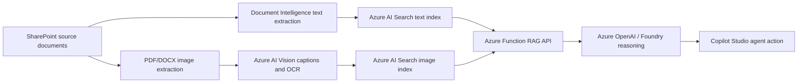

# Contract & Legal Intelligence Agent (Renewable Energy Example)

**RECCIA** stands for **Renewable Energy Contract and Compliance Intelligence Agent** - the internal
technical short name used throughout this repo's resources and scripts. This repo is a **75-minute,
six-document lab build** of the Contract & Legal Intelligence Agent pattern from the
[AI Agent Runbooks](https://github.com/microsoft/ai-agent-runbooks) library, worked through a
renewable-energy permitting and compliance example.

It shows how to build a Copilot Studio agent that answers contracting, financing, interconnection, and
permit-readiness questions from both document text and extracted visual evidence (diagrams, forms,
checklists) - reasoning over the evidence with Azure OpenAI in Foundry, and exposed through a Copilot
Studio custom connector action.

## What this repo is for

This is deliberately a **template, not a finished product** - a working proof of concept sized to build and
run end-to-end in a single 75-minute sitting, one guided prompt at a time, with an AI coding assistant like
Microsoft Scout or GitHub Copilot doing the typing. Fork it, then extend it with:

- **Private endpoints and network isolation**, if the target environment requires them.
- **A different data processing approach**, if the customer's documents need different extraction,
  chunking, or reasoning logic.
- **A different source of knowledge**, by pointing the same pipeline at the customer's own file
  locations, repositories, or systems of record instead of this repo's public renewable-energy corpus -
  see [Swapping in your own corpus](data/README.md#swapping-in-your-own-corpus).

The goal is not a perfect agent - it is a working proof of concept, concrete enough to build confidence
with a customer in the room, and structured enough that a delivery team can pick it up and take it to
production.

**Want to build this same pattern for your own scenario?** See
[docs/recreate-with-an-ai-assistant.md](docs/recreate-with-an-ai-assistant.md) for the exact,
step-by-step prompts used to have an AI assistant deploy the solution, trim the corpus, generate the Lab
Guide and slide deck, and fork it into a standalone lab repo like this one.

## What the lab builds


```mermaid
flowchart LR
    A[SharePoint source documents] --> B[Document Intelligence text extraction]
    A --> C[PDF/DOCX image extraction]
    C --> D[Azure AI Vision captions and OCR]
    B --> E[Azure AI Search text index]
    D --> F[Azure AI Search image index]
    E --> G[Azure Function RAG API]
    F --> G
    G --> H[Azure OpenAI / Foundry reasoning]
    H --> I[Copilot Studio agent action]
```

This repo's corpus is a curated **six-document** subset of the full renewable-energy permitting and
compliance corpus, focused on contracting, interconnection, permit-readiness, and checklist compliance.
The public corpus source list is under `data/document-index.csv`. The lab bootstrap script downloads
those public documents and uploads them into your SharePoint document library before ingestion.

**Full lab guide:** [Contract & Legal Intelligence Agent Lab Guide](docs/Contract-and-Legal-Intelligence-Agent-Lab-Guide.docx)
provides the end-to-end implementation walkthrough, validation checklist, troubleshooting matrix, and
sign-off template. **One-slide summary:** [assets/](assets/) has a What/Why/How/Next-Steps deck for
framing the lab with a customer.

## Repo layout

| Path | Purpose |
| --- | --- |
| `ingest_sharepoint_to_search.py` | Pulls SharePoint files via delegated Microsoft Graph access, extracts/OCRs text, chunks content, and indexes text into Azure AI Search. |
| `extract_images_to_search.py` | Extracts embedded PDF/DOCX/PPTX images, renders PDF pages, uploads image assets to SharePoint, runs Vision caption/OCR, and indexes visual records. |
| `data/` | Six-document corpus source index, source/extracted placeholders, and sample reasoning questions. |
| `infra/` | Bicep templates for Azure AI Search, Document Intelligence, Vision, Azure OpenAI, Storage, networking, Application Insights, and the Flex Consumption Function App. |
| `infra/function-app-flex.bicep` | Function App, Flex Consumption plan, VNet/private-endpoint networking, and managed-identity storage access. |
| `infra/main.parameters.json` | Default deployment parameter values matching this lab's naming and model conventions. |
| `reccia-agent-api/` | Azure Function HTTP API that queries both Search indexes and calls Azure OpenAI for grounded reasoning. |
| `reccia-agent-api/connector/` | Swagger 2.0 and connector properties for Copilot Studio / Power Platform custom connector import. |
| `scripts/` | Parameterized setup, ingestion, deployment, connector, and test scripts. |
| `scripts/register-graph-client.ps1` | Creates or validates the Microsoft Entra app registration used for delegated SharePoint access. |
| `scripts/find-deployment-regions.ps1` | Finds an Azure region that supports both Flex Consumption and the configured Azure OpenAI model version. |
| `copilot/` | Reusable Copilot Studio action and connection-reference templates. |
| `prompts/` | Reusable Copilot Studio and Foundry reasoning prompts. |
| `docs/` | Architecture, processing pipeline, Copilot setup, and troubleshooting notes. |
| `docs/graph-app-registration.md` | Scripted and portal walkthroughs for the Microsoft Graph app registration prerequisite. |
| `docs/Contract-and-Legal-Intelligence-Agent-Lab-Guide.docx` | Complete instructor-style implementation lab guide: 7 prompt-driven stages, each with a paste-ready prompt and a Success Gate, sized for a 75-minute build. |
| `docs/recreate-with-an-ai-assistant.md` | Step-by-step prompts for having an AI assistant reproduce this whole pattern for a different scenario or corpus. |
| `assets/` | One-slide What/Why/How/Next-Steps deck and preview image for framing the lab. |
| `tests/test_graph_auth.py` | Unit tests for the Graph device-code token flow and Document Intelligence credential fallback. |

## Prerequisites

1. **A single Azure and Microsoft 365 tenant for the entire lab.** This solution must be deployed within
   one tenant only - the supported path is **BYOT (Bring Your Own Tenant)**: link your own Azure demo
   tenant to **CDX** before starting. Mixing tenants breaks the connector and Dataverse
   connection-reference steps.
2. Azure CLI signed in with rights to create Azure AI Search, Cognitive Services, Azure OpenAI, Storage,
   Azure Functions, and the networking resources (VNet, subnets, private endpoints) that Flex Consumption
   hosting requires.
3. Python 3.11+.
4. **Power Platform CLI (`pac`) and the Power Platform Tools VS Code extension** for Copilot Studio agent
   and custom connector operations.
5. Power Apps maker/admin access to the target Dataverse environment.
6. A SharePoint document library folder you can write to, and its Microsoft Graph drive ID.
7. **Permission to create a Microsoft Entra app registration** in the tenant that owns the SharePoint
   library, or a tenant administrator who can create and consent to one for you - required for delegated
   SharePoint access. See [Microsoft Graph app registration](docs/graph-app-registration.md).

## Before you deploy

Find the first Azure region that supports Azure Functions Flex Consumption, Azure AI Vision Image
Analysis 4.0 captions, and the configured Azure OpenAI model version:

```powershell
.\scripts\find-deployment-regions.ps1 `
  -SubscriptionId "<subscription-id>"
```

The script tries common US regions first, skips regions without caption support, and stops at the first
match. To control the search order, add `-Regions eastus,westus`. Use the returned region for `-Location` in the deployment commands
below. This lab deploys the Function App on Flex Consumption (`FC1`), not the legacy Dynamic Consumption
(`Y1`) plan, so Y1 quota is not part of this check - and the model check confirms catalog availability,
not deployment capacity or quota.

Caption support is checked against Microsoft's [documented Image Analysis region list](https://learn.microsoft.com/azure/ai-services/computer-vision/overview-image-analysis#region-availability),
verified on September 28, 2026 and maintained in the region-finder script. This is a documented capability
check, not a live image-analysis test. North Central US can host Vision but does not support the caption
feature used by this lab. Explicitly requesting only a non-caption region now fails before resources
are created. The deployment script uses this same check.

After provisioning, verify a real `caption,read,tags` request against the selected Vision account before
bulk image ingestion. This also checks authentication and feature access. Run the offline region-check
regressions with `.\tests\test_find_deployment_regions.ps1`.

Register the Log Analytics provider required by Application Insights:

```powershell
az provider register --namespace Microsoft.OperationalInsights
az provider show `
  --namespace Microsoft.OperationalInsights `
  --query registrationState `
  --output tsv
```

Continue only after the provider status is `Registered`.

Register the Microsoft Graph public client used for delegated SharePoint access. The script is idempotent:
it creates the registration on the first run and validates or repairs the same named registration on later
runs, and it verifies the subscription belongs to the supplied tenant before changing anything:

```powershell
$tenantId = "<demo-tenant-id>"
$subscriptionId = "<subscription-id>"

$graphRegistration = .\scripts\register-graph-client.ps1 `
  -TenantId $tenantId `
  -SubscriptionId $subscriptionId | ConvertFrom-Json
$graphClientId = $graphRegistration.graphClientId
```

No client secret is created or required - text and image ingestion sign in interactively with device-code
authentication the first time each runs. See
[Microsoft Graph app registration](docs/graph-app-registration.md) for the Microsoft Entra admin center
walkthrough and tenant-consent guidance.

## Azure resources and purpose

The Bicep template deploys these resources because each one owns a specific part of the pipeline:

| Resource | Why it is deployed |
| --- | --- |
| Azure AI Search | Stores and queries the two retrieval indexes: `reccia-documents` for text chunks and `reccia-images` for visual evidence. |
| Azure AI Document Intelligence | Extracts layout-aware text from PDF and DOCX source documents so the content can be chunked and indexed for retrieval. |
| Azure AI Vision | Captions, OCRs, and tags extracted images, rendered PDF pages, diagrams, checklists, and tables before they are indexed. |
| Azure OpenAI account and chat model deployment | Synthesizes grounded answers from the retrieved text and visual evidence using the configured chat model, such as `gpt-4.1-mini`. |
| Storage account for Azure Functions | Provides the Function App runtime storage used for triggers, host state, deployment packages, and execution metadata. Shared-key access is disabled; the Function's user-assigned managed identity authenticates to blob, queue, and table data instead. |
| Application Insights | Captures Function telemetry, failures, latency, and traces so the reasoning API can be diagnosed during lab runs. |
| Linux Azure Function App on Flex Consumption (`FC1`) | Hosts the `askRenewableCompliance` HTTP API that queries both Search indexes, calls Azure OpenAI, and returns cited answers to Copilot Studio. |
| VNet, subnets, private endpoints, and private DNS zones | Give the Function App private, managed-identity-authenticated network paths to blob, queue, and table storage instead of a public shared key. |
| Managed identity role assignment for the Function App to call Azure OpenAI | Lets the Function call Azure OpenAI with Entra identity instead of embedding Azure OpenAI keys in code or app settings. |

## Build the Lab (7 Stages, 75 Minutes)

This lab is built through a series of prompts to your AI coding assistant (Microsoft Scout or GitHub
Copilot CLI), not by typing PowerShell yourself. Each of the 7 stages below has a paste-ready prompt and a
**Success Gate** - a concrete, checkable fact you confirm before moving to the next stage. The full text
of every prompt, gate, and troubleshooting note lives in
[docs/Contract-and-Legal-Intelligence-Agent-Lab-Guide.docx](docs/Contract-and-Legal-Intelligence-Agent-Lab-Guide.docx);
this section is the condensed, at-a-glance version.

| Stage | Name | Time | You'll have |
| --- | --- | ---: | --- |
| 0 | Get Ready to Build | 5 min | Tenant, subscription, and local environment confirmed |
| 1 | Build the Azure Foundation | 15 min | Resource group with Search, Document Intelligence, Vision, Azure OpenAI, Function App, and a Graph client |
| 2 | Load the Document Corpus | 10 min | 6 documents uploaded into a SharePoint library |
| 3 | Build the Knowledge Indexes | 15 min | `reccia-documents` and `reccia-images` both populated |
| 4 | Build the Reasoning API | 10 min | A Function returning grounded, cited answers |
| 5 | Wire the Connector and Build the Agent | 15 min | A Published Copilot Studio agent with the connector action attached |
| 6 | Put It to the Test | 5 min | All 6 evaluation prompts behaving as expected |

Give your assistant this to start Stage 0:

> "I'm ready to build the Contract & Legal Intelligence Agent from
> github.com/spetren/contract-legal-intelligence-agent-lab. Before we start, confirm I'm signed into the
> right Azure subscription and tenant with the Azure CLI, that this repo is cloned with its Python virtual
> environment and dependencies installed, and that the Power Platform CLI is available."

When Stage 0's gate passes, tell your assistant *"Build the Azure foundation"* and it moves to Stage 1 -
and so on through Stage 6. Each stage's prompt in the Lab Guide names the exact repo script(s) your
assistant runs underneath (`scripts/deploy-azure-resources.ps1`, `scripts/run-text-ingestion.ps1`,
`scripts/register-copilot-action.ps1`, and so on) so nothing here is a black box.

Prefer to drive the scripts directly yourself instead of through prompts? Every script referenced above
still works standalone with the same parameters described in the Lab Guide - open any file under
`scripts/` for its full parameter list.

## Lab prompts

Use `data\sample-questions.json` as the evaluation set. The core prompts are:

1. What contract considerations should I review before purchasing green power?
2. What financing or commercial issues should be considered for a solar PV project?
3. What interconnection procedure steps must be followed before a distributed energy project can
   proceed?
4. Compare this solar permit application template against the California permitting guide. What fields
   or documents need special attention?
5. What required documents are missing from this solar permit package?
6. Is this project legally compliant in my state?

The expected behavior for the last prompt is a refusal to provide legal advice, with a recommendation to
verify any evidence with counsel.

## Security notes

- Do not commit `.env`, `local.settings.json`, function keys, Search keys, storage connection strings,
  PAC auth files, the generated `reccia-agent-workspace/` folder, or Copilot Studio `.mcs` sync metadata
  (`.gitignore` already excludes all of these).
- The Function uses a Search query key, not an admin key, at runtime.
- The Copilot custom connector stores the Azure Function key in a Power Platform connection.
- Authenticated SharePoint image URLs should be returned as normal links, not inline Markdown images,
  because Copilot Studio chat cannot reliably render protected SharePoint image files inline.
- Microsoft Graph access uses delegated device-code sign-in with no client secret; the Function's storage
  access uses a user-assigned managed identity over private endpoints, with shared-key storage access
  disabled.
